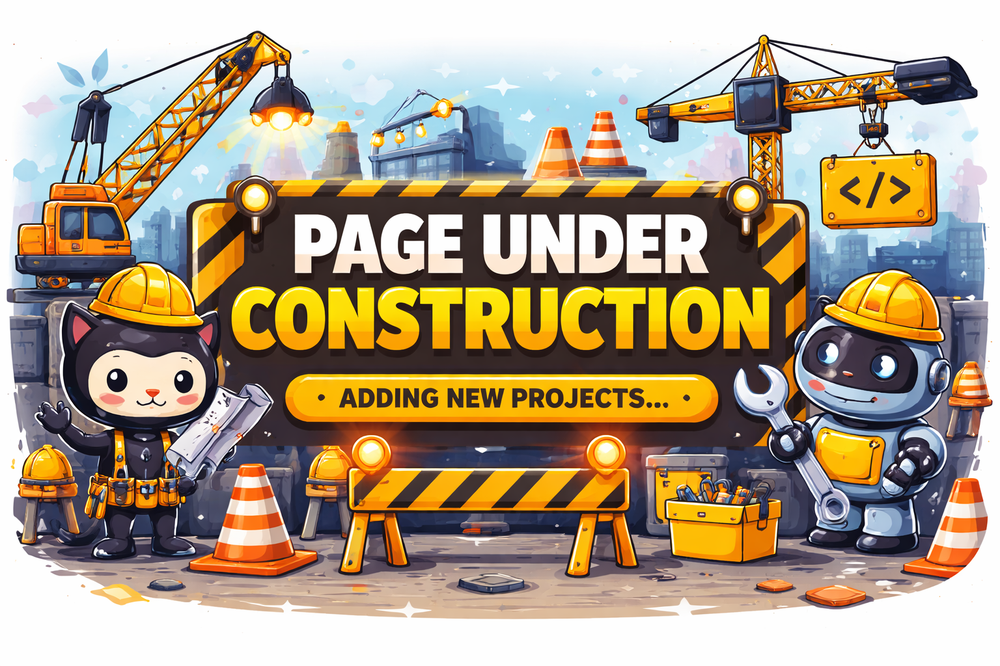

<div align="center">



# 👷‍♂️ Portfolio en construcción

🚧 **Estoy construyendo y subiendo proyectos de Data Science, Machine Learning, Data Engineering y Automatización con IA.**  
Este perfil se actualizará constantemente con proyectos reales, experimentos y soluciones aplicadas a problemas del mundo real.

</div>

---

## 🧠 ¿Quién soy?

Soy **Data Scientist & AI Automation Builder** enfocado en convertir datos en decisiones y procesos en sistemas inteligentes.  
Diseño soluciones que combinan **análisis de datos, machine learning y automatización con IA** para resolver problemas reales de negocio.

Trabajo con:
- 📊 Análisis y visualización de datos
- 🤖 Machine Learning & NLP
- ⚙️ ETL y pipelines de datos
- 🔁 **Automatización de procesos con IA (n8n, APIs, agentes, workflows)**
- 📈 Modelos aplicados a negocio

Actualmente estoy construyendo un **portfolio profesional** con proyectos reales en marketing, ecommerce, análisis de sentimiento, sistemas de recomendación y **automatizaciones inteligentes para empresas**.

---

## 🛠️ Tecnologías

```text
Python • Pandas • NumPy • Scikit-Learn • SQL • Power BI •
Machine Learning • NLP • ETL • APIs • n8n • AI Agents •
Git • GitHub
